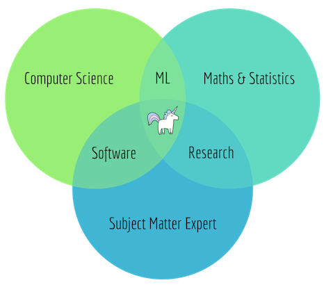
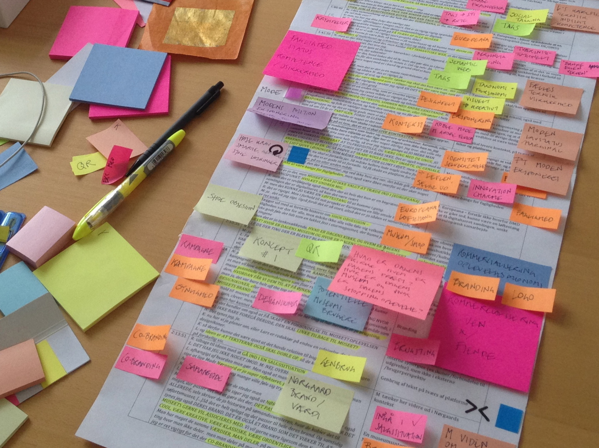
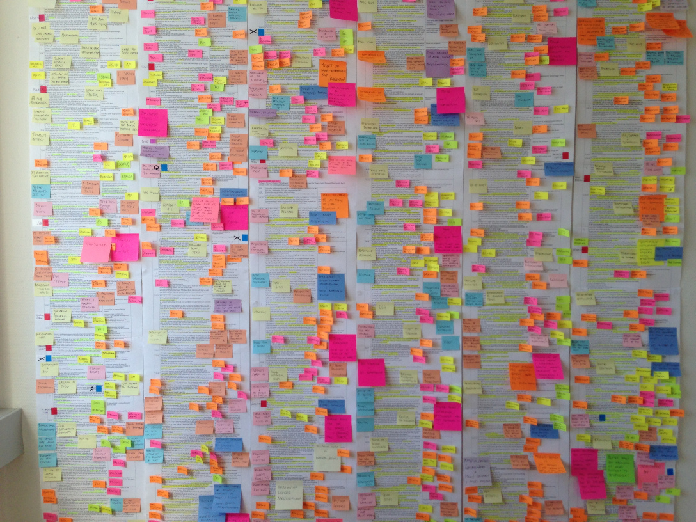

footer: @TheMartianLife | @parisba | #OReillySACon
theme: Business Class
slidenumbers: true

<!-- SHORT:
Data science, machine learning, and data manipulation and preparation are all core components of a future, trendy, world of software engineering. Many of these are built with "quick hacks," tiny scripts, or based on pipelines that are cobbled together from multiple components, frameworks, and the like. Mars Geldard and Paris Buttfield-Addison explore if software architecture matters to this world.

LONG:
Data science, machine learning, and data manipulation and preparation…all of these are core components of a future wave of software engineering. However, many of these components of the future wave are built upon “quick hacks,” “quick scripts,” or pipelines cobbled together from multiple frameworks and miscellaneous (often open source) components.

Mars Geldard and Paris Buttfield-Addison examine if software architecture matters in a world of big data and machine learning where software is a patchwork of pieces glued together by scripts and frameworks, or if it can matter due to the nature of the beast. Using a combination of original research, anecdotes, testimonials, and case studies from the real world, Mars and Paris explore whether data scientists, machine learning engineers, and other members of the latest generation of computing professionals, working with data and creating a patchwork, care about software architecture, or, indeed, can care about software architecture.

You’ll find out if architecture matters when you’re building a “little script,” or whether your “quick hack” needs any form of architectural knowledge, thought, or design. Everything is a pipeline made up of components, other people’s code, and tiny bits of glue code. Mars and Paris walk you through if this is just another way to accrue technical debt or if architecture truly doesn’t matter in this world. -->

# Does software architecture matter...
# ...in a world of 'quick hacks'?

### Mars Geldard & Paris Buttfield-Addison

^ PARIS: Welcome!

---

  
# [fit] 👋 Hello!

^ PARIS: Hi everyone!

---

^ MARS: We're Mars, and Paris. You can tweet us, we love that.

---

^ PARIS: We're from Tasmania, Australia.

---

# Data science, machine learning, numerical computing...

^ MARS: We're here to talk about data science, machine learning, numerical computing, all that sort of stuff.

---

# Data science, machine learning, numerical computing...
## Quick hacks!?

^ PARIS: Plus quick hacks, and how that all fits...

---

# We spoke at SACon NYC...

^ PARIS: This talk came about after we spoke at SA Con in New York City, in February this year.

---

# And we had a lot of great conversations.

^ MARS: And we had a lot of great conversations.

---

# Not dry and uninspiring.

^ ^ PARIS: We'd honestly expected SA Con to be really dry.  But it wasn't. 

---

# It was great.

^ MARS: It was great.

---

# It was exciting.

^ ^ PARIS: It was really exciting. We'd imagined Software Architects to be boring, unenthused, and all manner of other less than flattering things.

---

# Passionate people trying to improve things.

^ MARS: But we found a community of passionate people thinking and doing things to improve the technology industry as a whole.

---

# Conversations ensued.

^ PARIS: And we had some conversations. We're often doing machine learning, or data science work. And we noticed that a lot of the things the really interesting software architects we met were doing, or discuss, sounded a bit out of the ordinary in the data science world.

---

# So we did a little bit of research.

^ MARS: So we did a little bit of research.

---

^ PARIS: We both have a research background. I have a PhD in Computer Science, and I specialise in Qualitative Research into how and why people are behaving around, and with, technology.

---

^ MARS: I'm a ... data scientist, researcher, etc. Pretty damn amazing. (MARS FILL THIS IN)

---

> Data Scientist: The Sexiest Job of the 21st Century
-- https://hbr.org/2012/10/data-scientist-the-sexiest-job-of-the-21st-century

^ ^ PARIS: Data Science, starting about 8-10 years ago, starting to become the hottest thing in technology. 

---

# Do data scientists care about software architecture?

^ MARS: And we started to wonder: Does Data Science, and the associated domains of machine learning, and so on, care about things that Software Architects care about?

---

Diagram by Steven Geringer from IBM.

^ PARIS: People have thought about this before.

---

# Methodology | Qualitative

^ MARS: Our methodology was a fairly conventional qualitative approach.

---

# Methodology | Qualitative

- Surveys with free-form responses
- Semi-structured Interviews
- Textual analysis

^ ^ PARIS: Largely ventered around surveys, but also a couple of informal interviews with people. We also included a textual analysis of a many software architecture and data science writings, for interest's sake.

---

# Methodology | Qualitative | Analysis

- Coding
- Grounded-theory inspired approaches

^ MARS: Analysis was performed using coding, and a variety of thematic analysis and grounded-theory inspired approaches.

---

# Coding?

^ ^ PARIS: When talking to people who aren't regularly practising Qualitative Research, we've recently had to make a few asides to explain Coding.

---

^ MARS: Coding kind of looks like this.

---

^ PARIS: And this.

---

# Coding

## Identify common words, phrases.

^ MARS: You identify common words and phrases.

---

# Coding

## Identify common words, phrases.
## Build into themes, and codes.

^ PARIS: And then filter those into themes, or codes.

---

# If you are here for numbers, you might be disappointed.

^ MARS: This is qualitative research.

---

# So what did we find?

^ ^ PARIS: It's very preliminary, but it's been showing some interesting directions.

---

# Today's talk
## Some preliminary findings.

^ MARS: So, our talk today is some of our preliminary findings on this.

---

# Tentpole questions

^ PARIS: There's a few tentpole questions that we're going to structure this around.

---

# Tentpole questions

* What does 'software architecture' mean to you?
* What does 'software engineering' mean to you?
* What does 'tech debt' mean to you?
* Do you write 'little scripts' or do you 'architect a solution'? Do you do something else?
* Do you work with 'software architects'?
* Are you a 'software architect'?

^ MARS: We both have a lot of experience in qualitative research. So this talk takes that approach, mostly. And we'll touch on the implications of what we've found. We formed the survey around a bunch of tentpole questions, like these.

---

# Agenda 🧐

* discuss participation
* discuss results
* discuss what it all means
* next steps/recommendations

^ ^ PARIS: So, here's what we're going to do in this session.

---

# Questions at the end, please

^ MARS: We'll leave time for your questions at the end.

---

# Preliminary, exploratory

^ ^ PARIS: This session, and the research we did is going to keep going.

---

# Survey Participation

^ MARS: OK, so the primary means of data collection we used was a collection of free-form surveys. By free-form, we mean we asked for text answers, of as long as people felt like giving us.

---

# Huge response!

^ PARIS: We got a huge response. 

---

# Huge response!
## 470 participants so far

^ MARS: Great numbers. We were really blown away by the responses.

---

# Huge response!
## 470 participants so far
## Survey still going.

^ PARIS: We were expecting maybe 100 or so people. We're nearly at 500, and it's still going.

---

# Participant professions

^ MARS: We asked participants what they did. At the point we did some analysis to prepare for giving our preliminary findings in this talk, our breakdown was as follows.

---

# Participant professions

^ PARIS: When we performed our preliminary analysis to give this talk, we had 470 respondents. And people are still responding. This is an excellent response rate.  "Data Science", "Software Engineering", "Software Architecture", "Other".

---

# Coding Results

^ MARS: So let's look at what the coding resulted in..

---

# What does 'software architecture' mean?

^ PARIS: For our first set of preliminary results, let's take a look at what people think software architecture means. What's it mean to people?

---

# What does 'software architecture' mean?
# **Data Scientist**

^ MARS: First, the people who said they were mostly data scientists. 

---

# What does 'software architecture' mean?
# **Data Scientist**

> "Software architecture is a design created as a solution to a relatively large and complex software engineering problem."

^ PARIS: We got a lot of comments like this. Fairly straightforward, unambiguous comments on software architecture. I don't think too many folks at this conference would disagree with this, no?

---

# What does 'software architecture' mean?
# **Data Scientist**

> "Software architecture is the result of breaking down and modularising a large, inter-connected problem into a (hopefully) rational, elegant, and understandable set of interacting components."

^ MARS: We got a few slightly more descriptive ones, like this, as well.

---

# What does 'software architecture' mean?
# **Software Engineer**

^ PARIS: People who said they were primarily Software Engineers next.. 

---

# What does 'software architecture' mean?
# **Software Engineer**

> "Planning the building of software, factoring in requirements, limitations, audience, and developer experience. Designing to be modular, intelligent, and reusable."

^ MARS: They got a little more expressive with their description of software architecture. Trying to unpack its pieces. We got a lot responses like this from the software engineering crowd. 

---
# What does 'software architecture' mean?
# **Software Engineer**

> "Properly designed software!"

^ PARIS: We also got the, to be honest, expected, smartass comments. Like this one.

---

# What does 'software architecture' mean?
# **Software Engineer**

> "Properly designed software, rather than a big pile of spaghetti encased in mud."

^ MARS: And like this one. Lots and lots of smartass comments from the software engineering crowd.

---

# What does 'software architecture' mean?
# **Software Engineer**

> "Heavy sigh."

^ PARIS: Even comments like this, which we got, verbatim, in this exact form, 11 times, from software engineers. 

---

# What does 'software architecture' mean?
# **Software Engineer**

> "High level design, and decider or general toolset and technical direction."

^ MARS: But we also got a lot of thoughtful comments, that largely uncontroversial to anyone at this event, I think?

---

# What does 'software architecture' mean?
# **Software Engineer**

> "The collection of paradigms, data structures, methodologies, and high-level design used to build a given particular piece of software." 

^ PARIS: Pretty straightforward stuff.

---

# What does 'software architecture' mean?
# **Software Architect**

^ MARS: Next up, those who identified as working in software architecture. Theoretically these people are the same as the attendees at this event.

---

# What does 'software architecture' mean?
# **Software Architect**

> "The blueprint of future proofed, secure, progressively enhanced, decoupled, and perfectly integrated code."

^ PARIS: We got a lot of very thoughtful, wordy, yet generally uncontroversial responses, like this one.

---

# What does 'software architecture' mean?
# **Software Architect**

> "3tier/MVC/Micro services/etc"

^ MARS: We had a few people spit out some buzzwords. Which is fair enough, it's a fairly jargon heavy industry.

---

# What does 'software architecture' mean?
# **Software Architect**

> "Managing software engineers."

^ PARIS: A surprising number of people said that software architecture is "managing engineers". This isn't something we personally agree with, but it's probably unreasonably accurate. Even if we wouldn't like to admit it at this conference?

---

# What does 'software architecture' mean?
# **Software Architect**

> "Building software that serves its purpose."

^ MARS: We also got a few responses that looked like this, which I think is reasonable. 

---

# What does 'software architecture' mean?
# **Software Architect**

> "I've heard it called 'stuff that's hard to change later'. I like that definition."

^ MARS: Things like this cropped up too..

---

# What does 'software engineering' mean?

^ Next up, let's look at what people think Software Engineering means.

^ PARIS: 

---

# What does 'software engineering' mean?
# **Data Scientist**

^ MARS: Again, let's look at what the Data Scientist people think first.

---

# What does 'software engineering' mean?
# **Data Scientist**

> "Software engineering is a principled, professional approach to creating good software architecture."

^ PARIS: 

---

# What does 'software engineering' mean?
# **Data Scientist**

> "I mostly tend to differentiate between 'software engineering' and 'computer programming' by the scope and level of professional care involved."

^ MARS: 

---

# What does 'software engineering' mean?
# **Data Scientist**

> "Software engineering is designing and implementing components not just with the overall design/architecture in mind, but also the overarching goals of that architecture."

^ PARIS: 

---

# What does 'software engineering' mean?
# **Data Scientist**

> "Developing non-trivial software is kind of fractal in nature: as you zoom in, the level of complexity doesn't always decrease."

^ MARS: 

---

# What does 'software engineering' mean?
# **Software Engineer**

> "The development of software."

^ PARIS: 

---

# What does 'software engineering' mean?
# **Software Engineer**

> "A dream that we're good at our jobs."

^ MARS: 

---

# What does 'software engineering' mean?
# **Software Architect**

^ PARIS: 

---

# What does 'software engineering' mean?
# **Software Architect**

> "Nothing. It means nothing."

^ MARS: 

---

# What does 'software engineering' mean?
# **Software Architect**

> "The development and delivery of a defined software product of predicted and measurable quality to a predicted schedule."

^ PARIS: 

---

# What does 'software engineering' mean?
# **Software Architect**

> "Fine tuning the software you built."

^ MARS: 

---

# What does 'software engineering' mean?
# **Software Architect**

> "It's at a lower level than development. Anyone can develop a website, but only engineers can build a language and compiler/interpreter."

^ PARIS: 

---

# What does 'software engineering' mean?
# **Software Architect**

> "Evolutionary capabilities for the technology world."

^ MARS: 

---

# What does 'software engineering' mean?
# **Software Architect**

> "Creating something that doesn't degrade over time."

^ PARIS: 

---

# What can we learn from this?

^ PARIS: 

---

# Finding 

^ So, our first finding...

^ MARS: 

---

# Finding 
## Everyone mostly agrees on what software engineering, and software architecture means.

^ Everyone mostly agrees on what software engineering, and software architecture means. Most of the definitions we got are pretty consistent with what people running events, and talking about it, seem to think it is.

^ PARIS: 

---

# Finding 
## Everyone mostly agrees on what software engineering, and software architecture means.
## This is probably good ✅

^ MARS: This is probably good.

---

# Finding

^ Our next finding here, which logically follows the first...

^ PARIS: 

---

# Finding
## Data Scientists know what Software Architecture is.

^ MARS: ...is that Data Scientists, do, in fact, definitely know what Software Architecture is.

---

# Finding
## Data Scientists know what Software Architecture is.
## This is also probably good ✅

^ This is also probably good.

^ PARIS: 

---

# Is Software Architecture important to you? Is it part of your job?

^ MARS: Next up, let's look at whether people find SA important, and whether they feel like it's part of their job.

---

# Is Software Architecture important to you? Is it part of your job?
# **Data Scientist**

^ PARIS: 

---

# Is Software Architecture important to you? Is it part of your job?
# **Data Scientist**

> "No. I don't have time for it."

^ MARS: 

---

# Is Software Architecture important to you? Is it part of your job?
# **Data Scientist**

> "Nope. Too busy to think about it, and my job relies on getting data into the shape it needs to be to think too much about a clever architecture."

^ PARIS: 

---

# Is Software Architecture important to you? Is it part of your job?
# **Data Scientist**

> "Yes, it's very important. But I don't have the organisational support to 'practice' it."

^ PARIS: 

---

# Is Software Architecture important to you? Is it part of your job?
# **Data Scientist**

> "Incredibly important to me, but I'm not given the time or resources to make it part of my work."

^ MARS: 

---

# Is Software Architecture important to you? Is it part of your job?
# **Data Scientist**

> "I wish it could be but I don't get the space, resources or time to make it possible."

^ PARIS: 

---

# Is Software Architecture important to you? Is it part of your job?
# **Software Engineer**

^ MARS: 

---

# Is Software Architecture important to you? Is it part of your job?
# **Software Engineer**

> "I'm told it should be important to me, but I'm rarely given the support to make it part of my work."

^ PARIS: 

---

# Is Software Architecture important to you? Is it part of your job?
# **Software Engineer**

> "It's very important. I don't have time for it though."

^ MARS: 

---

# Is Software Architecture important to you? Is it part of your job?
# **Software Engineer**

> "Incredibly important, but my work is more important."

^ PARIS: 

---

# Is Software Architecture important to you? Is it part of your job?
# **Software Architect**

^ MARS: 

---

# Is Software Architecture important to you? Is it part of your job?
# **Software Architect**

> "It's so so important that they named my role after it! It's my primary responsibility."

^ PARIS: 

---

# Is Software Architecture important to you? Is it part of your job?
# **Software Architect**

> "Yes, very important. I'm doing it day to day, when I know what it is."

^ MARS: 

---

# Is Software Architecture important to you? Is it part of your job?
# **Software Architect**

> "Yes, super important but I don't get enough time to do, and am often expected to do other things."

^ PARIS: 

---

# What can we learn from this?

^ MARS: 

---

# Finding 

^ So, our first finding here...

^ PARIS: 

---

# Finding 
## Data Scientists find Software Architecture important.

^ MARS: 

---

# Finding 
## Data Scientists find Software Architecture important.
## This is good ✅

^ PARIS: 

---

# Finding 
## Data Scientists find Software Architecture important. ✅
## But don't get time to practice it.
## This is not so good ❌

^ MARS: 

---

# Finding 
## Software Engineers also find Software Architecture important.

^ PARIS: Next... 

---

# Finding 
## Software Engineers also find Software Architecture important. ✅

^ MARS: Again, good.

---

# Finding 
## Software Engineers also find Software Architecture important. ✅
## But also don't get time to practice it. ❌

^ PARIS: But also don't get time...

---

# Finding 
## Software Architects... are fine.

^ MARS: Also, software architects... they think it's important, and they're mostly busy doing it. Whatever they think it is.

---

# Does what you do lead to tech debt? What is tech debt?

^ PARIS: 

---

# Does what you do lead to tech debt? What is tech debt?
# **Data Scientist**

^ MARS: 

---

# Does what you do lead to tech debt? What is tech debt?
# **Data Scientist**

> "Tech debt is anything that ends up being a bad choice. Everything I do generates some kind of tech debt."

^ PARIS: 

---

# Does what you do lead to tech debt? What is tech debt?
# **Data Scientist**

> "Tech debt is a consequence of the way I have to work with data. I manipulate and massage data with pipelines of tools. They're not always designed to work together."

^ MARS: 

---

# Does what you do lead to tech debt? What is tech debt?
# **Data Scientist**

> "Almost everything I do has to be unpicked and rebuilt per-problem I'm trying to solve, or per-thing I'm trying to investigate."

^ PARIS: 

---

# Does what you do lead to tech debt? What is tech debt?
# **Data Scientist**

> "I generate a lot. I need to create a lot of code that hasn't got time or place to be tested or document because I'm working with lots of live data. Technical debt is more like a technical payday loan for a data scientist, I think."

^ MARS: 

---

# Does what you do lead to tech debt? What is tech debt?
# **Data Scientist**

> "I used to be a 'software engineer'. Now I'm a data scientist. What this practically means is that I make proofs of concept that get put into production. I get to iterate faster and do more stuff, but it's bad software engineering and bad software architecture."

^ PARIS: 

---

# Does what you do lead to tech debt? What is tech debt?
# **Software Engineer**

^ MARS: 

---

# Does what you do lead to tech debt? What is tech debt?
# **Software Engineer**

> "Tech debt is everything I do that isn't planned."

^ PARIS: 

---

# Does what you do lead to tech debt? What is tech debt?
# **Software Engineer**

> "Anything we don't plan properly leads to tech debt."

^ MARS: 

---

# Does what you do lead to tech debt? What is tech debt?
# **Software Architect**

^ PARIS: 

---

# Does what you do lead to tech debt? What is tech debt?
# **Software Architect**

> "Tech debt is when I don't do my job properly."

^ MARS: 

---

# Does what you do lead to tech debt? What is tech debt?
# **Software Architect**

> "If there is tech debt in my team it means I didn't do my job."

^ MARS: 

---

## Finding 

^ So, our first finding here...

^ MARS: 

---

## Finding 
## Everyone generally agrees on tech debt being bad.

^ PARIS: 

---

## Finding 
## Everyone generally agrees on tech debt being bad.
## ... but nobody really agrees on what tech debt is.

^ ?

^ MARS: 

---

<!-- [.background-color:#ff0000] -->

# What does data science mean for software architecture?

^ PARIS:

---

# What does data science mean for software architecture?
# **Data Scientist**

^ MARS: 

---

# What does data science mean for software architecture?
# **Data Scientist**

> "My [data science] work means that I make scripts, I don't make software. The scripts are software but they don't follow any kind of software process."

^ PARIS: 

---

# What does data science mean for software architecture?
# **Data Scientist**

> "I quickly hack something together based on business data needs. I don't have time to architect or design a solution. I wish I did."

^ MARS: 

---

# What does data science mean for software architecture?
# **Data Scientist**

> "It means I don't do software architecture. Hah."

^ PARIS: 

---

# What does data science mean for software architecture?
# **Data Scientist**

> "I'm just like a software architect, only I don't have to or have time to worry about security, scaleability, or performance."

^ MARS: 

---

# What does data science mean for software architecture?
# **Software Engineer**

^ PARIS: 

---

# What does data science mean for software architecture?
# **Software Engineer**

> "It means that when I work with the data science team I have to put more effort into thinking about how my work fits with theirs."

^ MARS: 

---

# What does data science mean for software architecture?
# **Software Engineer**

> "From what I've observed, it doesn't mean much. I don't hold that against them, though."

^ PARIS: 

---

# What does data science mean for software architecture?
# **Software Engineer**

> "It means I have to rewrite everything they did."

^ MARS: 

---

# What does data science mean for software architecture?
# **Software Architect**

^ PARIS: 

---

# What does data science mean for software architecture?
# **Software Architect**

> "It means I have to think a lot more about how the team works with data scientists."

^ MARS: 

---

# What does data science mean for software architecture?
# **Software Architect**

> "Absolutely nothing. Data science has no time for us, and we don't pay enough attention to their needs."

^ PARIS: 

---

# What does data science mean for software architecture?
# **Software Architect**

> "It's a domain that doesn't interact with software architecture as much as it should."

^ MARS: 

---

## Finding

^ So, what's to find from this?

^ PARIS: 

---

## Finding
## Again, software architecture is _important_ but not part of the job for data scientists.

^ MARS: 

---

## Finding
## Again, software architecture is _important_ but not part of the job for data scientists.
## Not so great ❌

^ PARIS: 

---

## Finding
## Software engineers and architects recognise this.

^ MARS: 

---

## Finding
## Software engineers and architects recognise this.
## This is good ✅

^ PARIS: 

---

## Overall Findings

^ MARS: 

---

## Overall Findings
# Most data scientists expressed a desire to follow better software architecture and software engineering practices in what they do.

^ PARIS: 

---

## Overall Findings
# Software engineers also want to absorb software architecture, but it's less important to them than to data scientists.

^ MARS: 

---

## Recommendations

^ PARIS: 

---

## Recommendations
# **Architecture doesn't matter to data scientists, but not because they don't care.**

^ MARS: 

---

# **Architecture doesn't matter to data scientists, but not because they don't care.**
# They need time and support to incorporate it.

^ PARIS: Finding a solution is more important than finding a good solution. Support them so that this doesn't have to be the case.

---

## Recommendations
# Most data scientists are passable programmers.

^ MARS: 

---

## Recommendations
# Most data scientists are passable programmers.
# Most data scientists are not software engineers.

^ PARIS: 

---

## Recommendations
# Help your data scientists become software engineers, and software architects.

^ MARS: 

---

## Recommendations
# Help your data scientists become software engineers, and software architects.
### ... or understand the jobs of those that are.

^ MARS: Or understand the jobs of those that are! Not everyone needs every skill.

---

## Recommendations
# Help your data scientists become software engineers, and software architects.

> "I'm just like a software engineer, without the bit where you write tests."

^ PARIS: This is a great quote, from a data scientist, that kind of illustrates this gap.

---

## Recommendations
# Help your data scientists become software engineers, and software architects.

> "Data science is like software engineering without code review. They review the data we generate, not our code."

^ MARS: And this quote, also from a data scientist...

---

## Recommendations
# Help your data scientists become software engineers, and software architects.

> "I know where the data science and the data scientists fit in what we do as architects, but we don't include them in the process. We kind of only include their data or their output, not their work process."

^ PARIS: And this quote, from an Architect... which illustrates this from the other side.

---

## Recommendations
# Help your data scientists become software engineers, and software architects.
# 😐

---

## Recommendations
# Help your data scientists become software engineers, and software architects.
## What's this look like?

^ PARIS: 

---

# Help your data scientists become software engineers, and software architects.
## What's this look like?
# 🤷‍♀ 🤷🏻‍♂️

^ MARS: 

---

## Recommendations
# We need more data scientists who are also _software_ people.

^ PARIS: 

---

## Recommendations
# We need more data scientists who are also _software_ people.
### ... but Mars has opinions.

^ MARS: <<OPINIONS GO HERE>>

---

## Recommendations
## Really, we need better integration between data science and software engineering/architecture.

^ PARIS

---
## Recommendations
## Really, we need better integration between data science and software engineering/architecture.
### Whatever that means?

^ MARS

---

## Recommendations
# This is not _one size fits all_.

^ MARS: 

---

## Recommendations
# We also need more _software people_ who embrace the nimble nature of data science.

^ PARIS: 

---

# Research is ongoing

^ MARS: this research is still ongoing...

---

# Research is ongoing
## http://lab.to/sa_survey

^ PARIS: and completing this survey would help, for future work...

---

# Thanks!
### **Full write-up soon at**  https://secretlab.institute

^ MARS: Thats everything! Please tweet us your thoughts.

---

^ PARIS: 

---

# Thanks!
### **Full write-up soon at**  https://secretlab.institute
### "Meet the Experts" at 3PM today (Expo Hall)

^ MARS: 

---

# Thanks!
### **Full write-up soon at**  https://secretlab.institute
### "Meet the Experts" at 3PM today (Expo Hall)
### Book Signing at 5:30 PM today (Expo Hall)

^ PARIS: 

<!-- 
What you have built is a great prototype of a predictive product, but you still have to push it through the engineering roadmap. What you need is a team of professional Software Engineers by your side to take your (disposable) proof of concept and turn it into a performant, reliable, loosely coupled and scalable system!

^ Having basic (or even advanced) programming skills is key to put your end to end experiment together, however it does not mean that you have created an application that is production ready. Unless you have come into Data Science and Machine Learning (ML) from an IT background and have tangible experience into building enterprise, distributed, solid systems, your Jupyter notebook does not qualify as a great piece of software and sadly does not make you a Software Engineer!

---

^ What you have built is a great prototype of a predictive product, but you still have to push it through the engineering roadmap. What you need is a team of professional Software Engineers by your side to take your (disposable) proof of concept and turn it into a performant, reliable, loosely coupled and scalable system! -->
